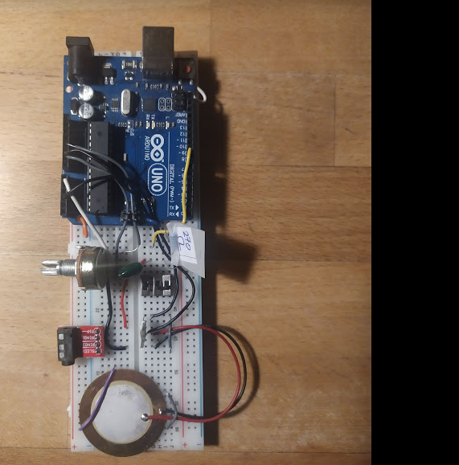

"# Arduino_Drum" 

A test project to get an Arduino Drum working.

This project is based upon the Mozzi Example Sketch: Piezo_SampleTrigger.  All I've added to it really is an if/else statement that adds the ability to choose between two samples.  

