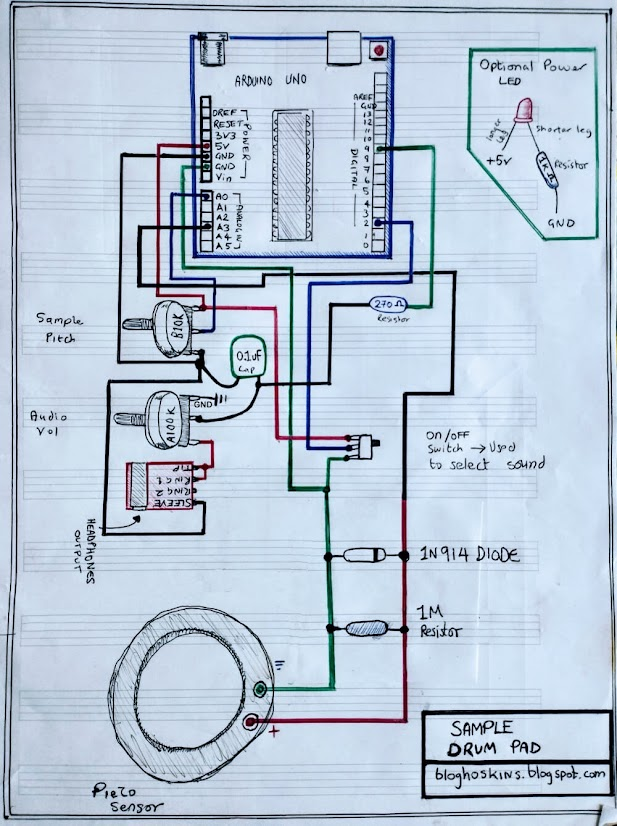
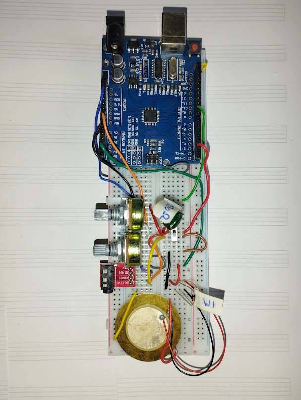
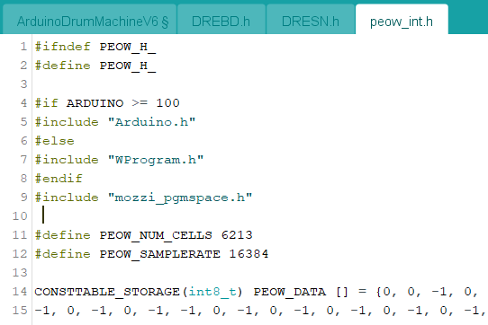

An Arduino Sampling Drum Pad. 

Lastest Code Version: Arduino_Sampling_Drum_Pad_V1.ino  

Remember:
You need to drag the .h sample files into the arduino IDE (see image below), and make sure the code matches the sample names etc.  Full guide coming soon. 

Features;
*Choose Between Two Samples
*Change Pitch/Playback Speed
*Volume (yes this is a feature)

